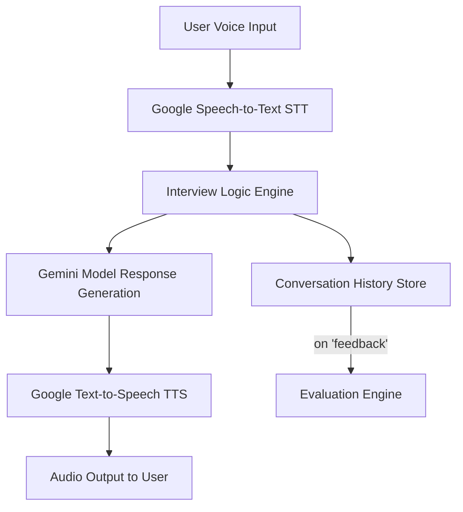

# 🎤 Interview Practice Partner

An AI-powered voice-based mock interview system designed to simulate real interview scenarios with adaptive conversation flow, follow-up questioning, and performance evaluation. The project supports interviews for **SDE**, **Data Analyst**, and **Sales / Business Development** roles, prioritizing **conversational realism** and **intelligent follow-ups**.

---

## 🚀 Features

- 🧠 **Realistic Interview Flow** using Gemini API (Gemini 2.5 Pro)
- 🎤 **Voice Interaction** using Google Cloud Speech-to-Text & Text-to-Speech
- 👂 **Adaptive Follow-Up Questions** based on user responses
- 📊 **Post-Interview Evaluation & Feedback**
- 🔁 **Multiple Role Modes** – SDE / Analyst / Sales interviews
- 🤖 **Human-like tone**: No robotic or templated behavior
- ✨ Handles different conversation styles: Chatty, Efficient, Confused, Off-topic, etc.

---

## 🧱 Project Architecture

## 🧠 Design Decisions

| Component | Decision | Reason |
|----------|-----------|--------|
| **Gemini 2.5 Pro** | Natural conversation & context-aware follow-ups | Human-like real interview experience |
| **Google STT & TTS** | Accurate real-time voice interaction | Enhances realism & fluency |
| **Streaming STT** | Captures natural pauses & short answers | Prevents robotic recording pauses |
| **Conversation history** | Stored for generating feedback | Personalized evaluation |
| **Role-specific prompts** | Different interview domains | Improves relevance & depth |

---

## 📦 Tech Stack

- Python 3.10+
- Google Cloud Speech-to-Text
- Google Cloud Text-to-Speech
- Gemini 2.5 Pro API
- PyAudio
- dotenv

---

## Setup Instructions
- 1. Clone Repository
-- git clone https://github.com/nikkhilmaurya/interview-practice-partner.git
-- cd interview-practice-partner

- 2. Install Dependencies
-- pip install -r requirements.txt

- 3. Environment Variables

-- Create .env

-- GEMINI_API_KEY="your_key_here"
-- GOOGLE_APPLICATION_CREDENTIALS="path_to_google_service.json"

- 4. Run Application
-- python3 main.py

## Demo Scenarios to Test
| Scenario Type      | Example Behavior                   |
| ------------------ | ---------------------------------- |
| **Confused User**  | "I don't know what job to choose…" |
| **Efficient User** | Gives precise factual answers      |
| **Chatty User**    | Long unrelated stories             |
| **Edge Case User** | Invalid / off-topic answers        |

## Evaluation Criteria Mapping
| Requirement              | How it is implemented                              |
| ------------------------ | -------------------------------------------------- |
| Conversational Quality   | Context-aware Gemini prompts, acknowledgment rules |
| Agentic Behaviour        | Intelligent probing and follow-ups                 |
| Technical Implementation | Google cloud APIs, real-time voice pipeline        |
| Intelligence             | Deep dive on tech words, project reasoning         |
| Adaptability             | Reactive responses & handling different personas   |

## 📁 Repository Structure
- 📦 interview-practice-partner
-- ┣ 📜 main.py
--- ┣ 📜 requirements.txt
---- ┣ 📜 README.md
----- ┗ 📜 .env.example

## 🏁 Final Note

This project focuses on delivering human-like interviewing experience rather than just Q&A response generation. It aims to help candidates improve performance, confidence, and technical articulation.
